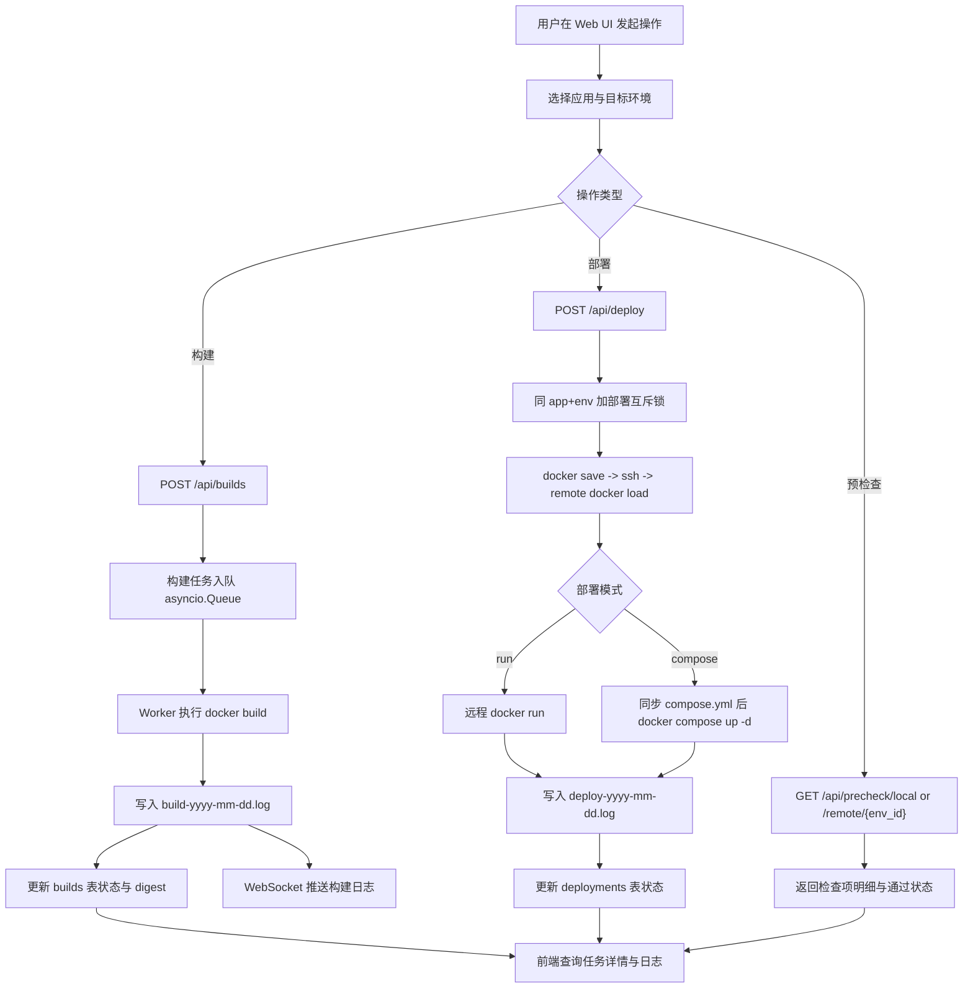

# Orion Docker 发布平台

轻量级本地 Docker 构建 + 远程部署平台，聚焦以下能力：

- 在线编辑 Dockerfile / Compose 文件
- 本地构建镜像（仅保存在本地 Docker Daemon）
- 通过 SSH 将镜像传输到远程主机并部署
- 支持 `docker run` 与 `docker compose` 两种部署模式
- 全流程日志持久化与任务可追溯
- 所有运行产物统一落地在 `~/Orion`

---

## 1. 调整确认后的系统定位

基于需求，当前实现采用 **FastAPI + SQLite + Paramiko + asyncio** 的单体后端架构，重点保证：

1. 本地优先（不依赖 Registry）
2. 流程可追踪（构建/部署记录 + 日志文件）
3. 运行目录标准化（默认 `ORION_HOME=~/Orion`）
4. 并发受控（构建队列 + 部署互斥锁）

相较原始设计，本次实现增加了两个基础管理接口用于落地闭环：

- `apps`：应用元信息管理
- `environments`：远程环境管理

---

## 2. 运行目录结构

默认工作目录（可通过环境变量 `ORION_HOME` 覆盖）：

```bash
~/Orion/
│
├── workspace/                 # 应用源码工作区
│   └── {app_name}/
│
├── builds/                    # 构建临时目录（按 build_id）
│   └── {build_id}/
│
├── logs/
│   ├── build-yyyy-mm-dd.log   # 构建日志
│   └── deploy-yyyy-mm-dd.log  # 部署日志
│
├── artifacts/
│   └── images/
│
├── compose/
│   └── {app}/{env}/compose.yml
│
├── runtime/
│   └── {app}/{env}/
│
├── backups/
│
└── database/
    └── orion.db
```

说明：

- 日志按日期归档
- `builds/{id}` 为可清理临时目录
- compose 文件历史可保留用于回滚

---

## 3. 系统总体架构

```text
Frontend(Web UI / CLI)
    ↓ HTTP / WebSocket
FastAPI API Layer
    ↓
Service Layer (Build / Deploy / Precheck / Logging)
    ↓
Execution Layer (Docker CLI / Paramiko SSH)
    ↓
Local Docker Daemon + Remote Docker Host
```

分层职责：

- API Layer：参数校验、状态返回、任务触发
- Service Layer：业务编排、并发控制、日志归档
- Execution Layer：执行 `docker build` / `docker run` / `docker compose` / SSH 远程命令

### 3.1 系统整体流程图



---

## 4. 技术选型

后端：

- Python 3.11+
- FastAPI
- SQLAlchemy 2.x
- SQLite
- Paramiko
- asyncio
- Pydantic v2

前端（当前实现）：

- 原生 HTML + CSS + JavaScript（零构建、快速落地）
- 后端同进程静态资源服务（`/` + `/assets`）
- WebSocket（构建日志流）

---

## 5. 数据库设计（SQLite）

数据库路径：

```bash
~/Orion/database/orion.db
```

### 5.1 apps

```sql
CREATE TABLE apps (
    id INTEGER PRIMARY KEY AUTOINCREMENT,
    name TEXT UNIQUE NOT NULL,
    description TEXT,
    created_at DATETIME DEFAULT CURRENT_TIMESTAMP
);
```

### 5.2 environments

```sql
CREATE TABLE environments (
    id INTEGER PRIMARY KEY AUTOINCREMENT,
    name TEXT NOT NULL,
    host TEXT NOT NULL,
    port INTEGER DEFAULT 22,
    username TEXT NOT NULL,
    password TEXT NOT NULL,
    created_at DATETIME DEFAULT CURRENT_TIMESTAMP
);
```

### 5.3 builds

```sql
CREATE TABLE builds (
    id INTEGER PRIMARY KEY AUTOINCREMENT,
    app_id INTEGER NOT NULL,
    image_tag TEXT NOT NULL,
    image_digest TEXT,
    status TEXT NOT NULL,          -- queued/running/success/failed
    log_file TEXT NOT NULL,
    error_message TEXT,
    created_at DATETIME DEFAULT CURRENT_TIMESTAMP,
    FOREIGN KEY(app_id) REFERENCES apps(id)
);
```

### 5.4 deployments

```sql
CREATE TABLE deployments (
    id INTEGER PRIMARY KEY AUTOINCREMENT,
    app_id INTEGER NOT NULL,
    environment_id INTEGER NOT NULL,
    image_digest TEXT,
    mode TEXT NOT NULL,            -- run/compose
    status TEXT NOT NULL,          -- queued/running/success/failed
    log_file TEXT NOT NULL,
    error_message TEXT,
    created_at DATETIME DEFAULT CURRENT_TIMESTAMP,
    FOREIGN KEY(app_id) REFERENCES apps(id),
    FOREIGN KEY(environment_id) REFERENCES environments(id)
);
```

---

## 6. 构建设计（本地 Docker）

### 6.1 构建流程

1. 创建 `builds` 记录，状态 `queued`
2. 进入构建队列（`asyncio.Queue`）
3. worker 取任务，状态改为 `running`
4. 准备上下文目录（默认 `~/Orion/workspace/{app_name}`）
5. 如提交在线 Dockerfile，则写入 `~/Orion/builds/{build_id}/Dockerfile`
6. 执行 `docker build`
7. 流式写入日志（文件 + WebSocket）
8. 查询镜像 digest（可用则记录）
9. 完成后状态改为 `success/failed`

补充：

- 支持“构建配置”保存与复用（参数模板化）
- 支持配置列表管理（创建、更新、删除、按配置一键构建）

### 6.2 构建日志

写入：

```bash
~/Orion/logs/build-yyyy-mm-dd.log
```

格式：

```text
[2026-02-28 10:21:33] [BUILD_ID=23] Step 1/8 : FROM python:3.11
```

---

## 7. 镜像管理策略

- 镜像仅存于本地 Docker Daemon
- 不推送 Registry
- 构建记录中保存 `image_tag` 与 `image_digest`（可用时）
- 可通过 `docker images --digests` 审计

---

## 8. 远程部署设计

### 8.1 镜像传输

实现采用无中间 tar 文件的流式传输（基于 Paramiko SSH 通道，将本地 `docker save` 输出流直接写入远程 `docker load`）：

```text
docker save image_ref -> ssh remote docker load
```

### 8.2 run 模式

1. 远程尝试删除旧容器（同名）
2. 执行 `docker run -d ... image_ref`

### 8.3 compose 模式

1. 本地生成/保存 compose 文件：`~/Orion/compose/{app}/{env}/compose.yml`
2. 同步到远端：`/opt/orion/{app}/{env}/compose.yml`（默认）
3. 执行 `docker compose -f ... up -d`

---

## 9. 预检查设计

### 9.1 本地预检查 `/api/precheck/local`

- Docker daemon 连通性（`docker info`）
- Docker 版本
- 磁盘可用空间
- 构建缓存信息（`docker system df`）
- Docker Socket 访问权限

### 9.2 远程预检查 `/api/precheck/remote/{env_id}`

- 用户名 + 密码 SSH 连通性
- 远程 Docker 可用
- 远程 Compose 可用
- 远程磁盘空间

---

## 10. API 设计

### 10.1 基础管理

- `POST /api/apps`
- `GET /api/apps`
- `PUT /api/apps/{id}`
- `DELETE /api/apps/{id}`
- `POST /api/environments`
- `GET /api/environments`
- `PUT /api/environments/{id}`
- `DELETE /api/environments/{id}`
- `POST /api/environments/test-connection`
- `POST /api/environments/{id}/test-connection`

### 10.2 构建

- `POST /api/builds`
- `GET /api/builds/{id}`
- `GET /api/builds/{id}/logs`
- `WS  /api/builds/ws/{id}/logs`
- `GET /api/build-configs`
- `POST /api/build-configs`
- `GET /api/build-configs/{id}`
- `PUT /api/build-configs/{id}`
- `DELETE /api/build-configs/{id}`
- `POST /api/build-configs/{id}/run`

### 10.3 部署

- `POST /api/deploy`
- `GET /api/deploy`（部署历史列表）
- `GET /api/deploy/{id}`
- `GET /api/deploy/{id}/logs`
- `GET /api/deploy-configs`
- `POST /api/deploy-configs`
- `GET /api/deploy-configs/{id}`
- `PUT /api/deploy-configs/{id}`
- `DELETE /api/deploy-configs/{id}`
- `POST /api/deploy-configs/{id}/run`

### 10.4 镜像仓库

- `GET /api/image-repo/images`（本地 Docker 镜像分页列表，按创建时间倒序）
  - 查询参数：`page`（默认 `1`）、`page_size`（默认 `10`，最大 `100`）
  - 返回结构：`items/page/page_size/total/total_pages`
- `POST /api/image-repo/deploy`（先执行远程预检，预检通过后按镜像发起部署）

### 10.5 预检查

- `GET /api/precheck/local`
- `GET /api/precheck/remote/{env_id}`

---

## 11. 并发与互斥策略

- 构建：`asyncio.Queue` + worker 池（`MAX_CONCURRENT_BUILDS`）
- 构建超时：支持任务级超时（默认 `1800s`）
- 部署：同 `app_id + environment_id` 使用互斥锁，避免并行部署冲突

---

## 12. 安全设计

- 远程 SSH 统一用户名 + 密码认证
- 应用名称强校验：不允许包含任何空白字符
- 不执行任意用户拼接 shell，命令参数化并最小化暴露面
- 构建上下文目录必须存在且可控
- 关键操作全日志留痕

---

## 13. 回滚与清理策略

回滚：

- run：指定历史 digest/tag 重新部署
- compose：恢复历史 compose 文件并重新 `up -d`

清理：

- 保留每应用最近 N 个镜像（后续可配置化）
- 定期 `docker image prune` / `docker builder prune`
- 清理 `builds/{id}` 临时目录

---

## 14. 项目代码结构（仓库）

```bash
Orion/
├── app/
│   ├── api/
│   │   ├── deps.py
│   │   └── routes/
│   ├── core/
│   ├── db/
│   ├── models/
│   ├── schemas/
│   ├── services/
│   ├── bootstrap.py
│   └── main.py
├── scripts/
│   └── init.sh
├── requirements.txt
└── README.md
```

---

## 15. 快速开始

### 15.1 安装依赖

```bash
cd /Users/shu/github/Orion
python3 -m venv .venv
source .venv/bin/activate
pip install -r requirements.txt
```

### 15.2 初始化目录与数据库

```bash
./scripts/init.sh
```

### 15.3 启动服务

```bash
uvicorn app.main:app --host 0.0.0.0 --port 8000 --reload
```

### 15.4 健康检查

```bash
curl http://127.0.0.1:8000/healthz
```

---

## 16. 环境变量

- `ORION_HOME`：运行产物根目录（默认 `~/Orion`）
- `MAX_CONCURRENT_BUILDS`：最大并发构建数（默认 `2`）
- `BUILD_TIMEOUT_SECONDS`：构建超时秒数（默认 `1800`）
- `DEPLOY_TIMEOUT_SECONDS`：部署超时秒数（默认 `1800`）

---

## 17. 未来扩展方向

- 引入私有 Registry（可选）
- 多构建节点
- Webhook 自动构建
- 审批流与变更窗口
- 灰度/金丝雀发布

---

## 18. 当前结论

Orion 当前已形成可运行的后端基础版本，满足“本地构建 + SSH 远程部署 + 日志可追溯 + SQLite 轻量存储”的核心目标，并为前端 UI、审批流、自动化发布等后续能力保留了扩展接口。

---

## 19. 前端 UI 设计文档

前端功能页面设计已独立整理为：

- [docs/frontend-ui-design.md](/Users/shu/github/Orion/docs/frontend-ui-design.md)
